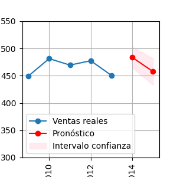
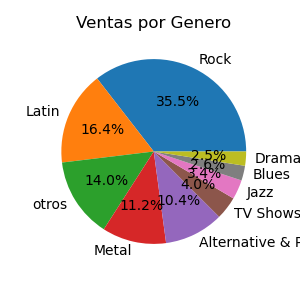
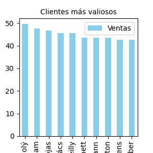
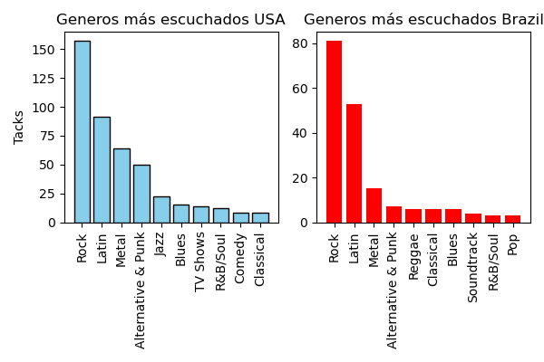

# sqlite-chinook-project
Proyecto de práctica en SQLite usando la base de datos de ejemplo Chinook.

Este repositorio contiene un proyecto de práctica en **SQLite** utilizando la base de datos de ejemplo **Chinook**.  
El propósito es aprender a consultar, analizar y documentar datos de un sistema relacional mediante **consultas SQL** y, en algunos casos, integrarlo con **Python** para análisis adicional.  

---

## 🎯 Intención del Proyecto

El proyecto busca:

1. Familiarizarse con una base de datos relacional completa.  
2. Practicar **consultas SQL** que resuelvan problemas de análisis de datos.  
3. Documentar las tablas y sus relaciones.  
4. Resolver un conjunto de **objetivos/retos analíticos**.  

---

## 📂 Estructura de la Base de Datos Chinook

La base de datos **Chinook** modela una tienda de música digital. Incluye información sobre artistas, álbumes, géneros, clientes, facturas y más.  
A continuación, se describen sus tablas principales:

### 1. `employees`
Información de los empleados de la compañía.  
- **Claves:** `EmployeeId` (PK)  
- **Campos:** nombre, cargo, jefe (`ReportsTo`), fecha de contratación, contacto, etc.  
- **Ejemplo:** saber qué empleados reportan a un gerente.

### 2. `customers`
Lista de clientes de la tienda.  
- **Claves:** `CustomerId` (PK), `SupportRepId` (FK → `employees`)  
- **Ejemplo:** clientes asignados a un representante de soporte.

### 3. `invoices`
Facturas emitidas a los clientes.  
- **Claves:** `InvoiceId` (PK), `CustomerId` (FK → `customers`)  
- **Ejemplo:** compras realizadas por cada cliente.

### 4. `invoice_items`
Detalle de las facturas (qué pistas se compraron).  
- **Claves:** `InvoiceLineId` (PK), `InvoiceId` (FK), `TrackId` (FK)  
- **Ejemplo:** conocer qué canciones componen cada factura.

### 5. `artists`
Catálogo de artistas musicales.  
- **Claves:** `ArtistId` (PK)  
- **Ejemplo:** artista con más álbumes publicados.

### 6. `albums`
Listado de álbumes musicales.  
- **Claves:** `AlbumId` (PK), `ArtistId` (FK)  
- **Ejemplo:** obtener todos los álbumes de un artista.

### 7. `tracks`
Listado de canciones.  
- **Claves:** `TrackId` (PK), `AlbumId` (FK), `MediaTypeId` (FK), `GenreId` (FK)  
- **Campos:** título, compositor, duración, tamaño, precio.  
- **Ejemplo:** duración promedio de canciones por género.

### 8. `genres`
Catálogo de géneros musicales.  
- **Claves:** `GenreId` (PK)  
- **Ejemplo:** género con mayor número de canciones.

### 9. `media_types`
Tipos de formatos de audio.  
- **Claves:** `MediaTypeId` (PK)  
- **Ejemplo:** canciones por tipo de archivo.

### 10. `playlists`
Playlists de la base de datos.  
- **Claves:** `PlaylistId` (PK)  
- **Ejemplo:** listar las canciones de una playlist.

### 11. `playlist_track`
Tabla puente (muchos-a-muchos) entre playlists y canciones.  
- **Claves:** `PlaylistId` (FK), `TrackId` (FK)  
- **Ejemplo:** identificar qué playlists incluyen una canción.

---
  

## 📝 Objetivos del Proyecto

A continuación, se proponen consultas SQL organizadas en distintos niveles de dificultad.  

### 🔹 Consultas básicas (calentamiento)
- ¿Cuántos clientes hay en cada país?  
- Lista los 10 artistas con más álbumes registrados.  
- ¿Qué géneros tienen más canciones en la base de datos?  
- ¿Qué empleados trabajan en cada ciudad y quién es su jefe?  

### 🔹 Consultas intermedias (JOINs dobles o triples)
- ¿Cuáles son los clientes que más dinero han gastado en total?  
- Lista los 5 clientes principales de cada país (Top 5 por país en gasto).  
- ¿Qué artista tiene más canciones en la base de datos y cuántas?  
- ¿Cuál es la canción más cara vendida (según el precio unitario en `InvoiceLine`)?  
- ¿Qué empleados han generado más ingresos por ventas (sumando sus facturas asociadas)?  

### 🔹 Consultas avanzadas (CTEs, subconsultas, agrupamientos)
- ¿Cuál es el género musical más vendido en cada país?  
- ¿Cuál es el promedio de duración (en minutos) de las canciones por género?  
- ¿Cuál es el ingreso total generado por cada artista?  
- ¿Qué porcentaje de ventas representan los 3 artistas más vendidos respecto al total?  
- Encuentra el mes con mayores ventas en toda la historia de la tienda.  
- ¿Qué país tiene el mayor gasto promedio por cliente?  

### 🔹 Ideas más analíticas
- Ranking de clientes: ¿Quiénes son los 10 más valiosos (*highest lifetime value*)?  
- ¿Qué género prefieren los clientes de USA frente a los de Brasil?  
- ¿Hay correlación entre duración de las canciones y su precio unitario?  

---

## 🚀 Tecnologías

- **SQLite** como motor de base de datos.  
- **SQL** para consultas.  
- **Python:** `sqlite3`, `pandas`, `jupyter` para análisis adicional.  

---

## 📌 Referencias

- [SQLite Tutorial - Sample Database](https://www.sqlitetutorial.net/sqlite-sample-database/)  
- Documentación oficial de SQLite  

---
    
