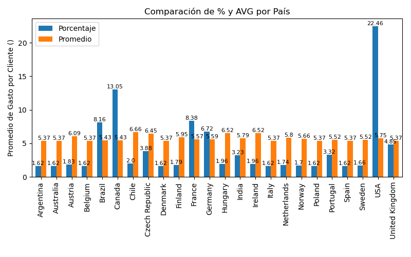
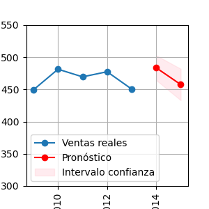
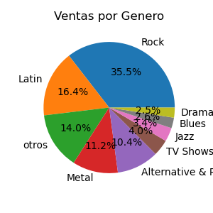
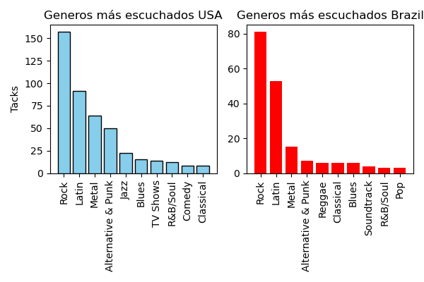

# Sales Analysis in a Relational Database (SQLite – Chinook)

Proyecto de análisis de la base de datos relacional Chinook, enfocado en la exploración, consulta y análisis de información de ventas, clientes y productos musicales.

Se diseñaron y ejecutaron consultas SQL de complejidad creciente (JOINs, subconsultas y CTEs) para responder preguntas de negocio como ingresos por país, clientes más valiosos, desempeño por género musical y tendencias temporales.

El proyecto integra SQLite, SQL y Python (pandas, Jupyter) para análisis adicional y visualización, y documenta de forma clara la estructura de la base de datos y los resultados obtenidos.

---

##  Estructura de la Base de Datos Chinook

La base de datos **Chinook** modela una tienda de música digital. Incluye información sobre artistas, álbumes, géneros, clientes, facturas y más.  
A continuación, se describen sus tablas principales:

##  Chinook Database Structure
| Table          | Description                                 | Primary Key   |
| -------------- | ------------------------------------------- | ------------- |
| employees      | Company employees and reporting structure   | EmployeeId    |
| customers      | Customer profiles and assigned support reps | CustomerId    |
| invoices       | Sales invoices issued to customers          | InvoiceId     |
| invoice_items  | Line items for each invoice (tracks sold)   | InvoiceLineId |
| artists        | Music artists catalog                       | ArtistId      |
| albums         | Albums released by artists                  | AlbumId       |
| tracks         | Individual music tracks                     | TrackId       |
| genres         | Music genres                                | GenreId       |
| media_types    | Audio file formats                          | MediaTypeId   |
| playlists      | User-defined playlists                      | PlaylistId    |
| playlist_track | Bridge table between playlists and tracks   | —             |

#### 1. `employees`
Información de los empleados de la compañía.  
- **Claves:** `EmployeeId` (PK)  
- **Campos:** nombre, cargo, jefe (`ReportsTo`), fecha de contratación, contacto, etc.  

#### 2. `customers`
Lista de clientes de la tienda.  
- **Claves:** `CustomerId` (PK), `SupportRepId` (FK → `employees`)  

#### 3. `invoices`
Facturas emitidas a los clientes.  
- **Claves:** `InvoiceId` (PK), `CustomerId` (FK → `customers`)  

#### 4. `invoice_items`
Detalle de las facturas (qué pistas se compraron).  
- **Claves:** `InvoiceLineId` (PK), `InvoiceId` (FK), `TrackId` (FK)  

#### 5. `artists`
Catálogo de artistas musicales.  
- **Claves:** `ArtistId` (PK)  

#### 6. `albums`
Listado de álbumes musicales.  
- **Claves:** `AlbumId` (PK), `ArtistId` (FK)  

#### 7. `tracks`
Listado de canciones.  
- **Claves:** `TrackId` (PK), `AlbumId` (FK), `MediaTypeId` (FK), `GenreId` (FK)  
- **Campos:** título, compositor, duración, tamaño, precio.  

#### 8. `genres`
Catálogo de géneros musicales.  
- **Claves:** `GenreId` (PK)  

#### 9. `media_types`
Tipos de formatos de audio.  
- **Claves:** `MediaTypeId` (PK)  

#### 10. `playlists`
Playlists de la base de datos.  
- **Claves:** `PlaylistId` (PK)  

#### 11. `playlist_track`
Tabla puente (muchos-a-muchos) entre playlists y canciones.  
- **Claves:** `PlaylistId` (FK), `TrackId` (FK)  

---
  

## Objetivos del Proyecto  
A continuación, se proponen consultas SQL organizadas en distintos niveles de dificultad.  
### 🔹 Consultas básicas  
- ¿Cuántos clientes hay en cada país?  
- Lista los 10 artistas con más álbumes registrados.  
- ¿Qué géneros tienen más canciones en la base de datos?  
- ¿Qué empleados trabajan en cada ciudad y quién es su jefe?  
### 🔹 Consultas intermedias (JOINs dobles o triples)  
- ¿Cuáles son los clientes que más dinero han gastado en total?  
- Lista los 5 clientes principales de cada país (Top 5 por país en gasto).  
- ¿Qué artista tiene más canciones en la base de datos y cuántas?  
- ¿Cuál es la canción más cara vendida (según el precio unitario en `InvoiceLine`)?  
- ¿Qué empleados han generado más ingresos por ventas (sumando sus facturas asociadas)?  
### 🔹 Consultas avanzadas (CTEs, subconsultas, agrupamientos)  
- ¿Cuál es el género musical más vendido en cada país?  
- ¿Cuál es el promedio de duración (en minutos) de las canciones por género?  
- ¿Cuál es el ingreso total generado por cada artista?  
- ¿Qué porcentaje de ventas representan los 3 artistas más vendidos respecto al total?  
- Encuentra el mes con mayores ventas en toda la historia de la tienda.  
- ¿Qué país tiene el mayor gasto promedio por cliente?  

### 🔹 Business Questions Addressed    
- Ranking de clientes: ¿Quiénes son los 10 más valiosos (*highest lifetime value*)?  
- ¿Qué género prefieren los clientes de USA frente a los de Brasil?  
- ¿Hay correlación entre duración de las canciones y su precio unitario?
- Proyección de Crecimiento de Ventas

## Key Analyses & Visuals    
- Sales by country
- Top customers by total revenue
- Revenue by genre and artist
- Monthly sales trends
---
##  Tools  
- **SQLite** como motor de base de datos.  
- **SQL** para consultas.  
- **Python:** (sqlite3, pandas, Jupyter).  
---
## 📌 Referencias  
- [SQLite Tutorial - Sample Database](https://www.sqlitetutorial.net/sqlite-sample-database/)  
- Documentación oficial de SQLite  

---
 
